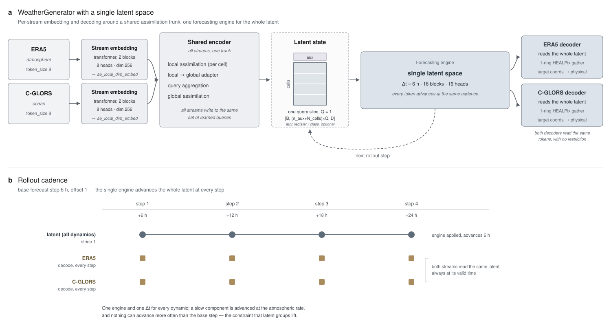
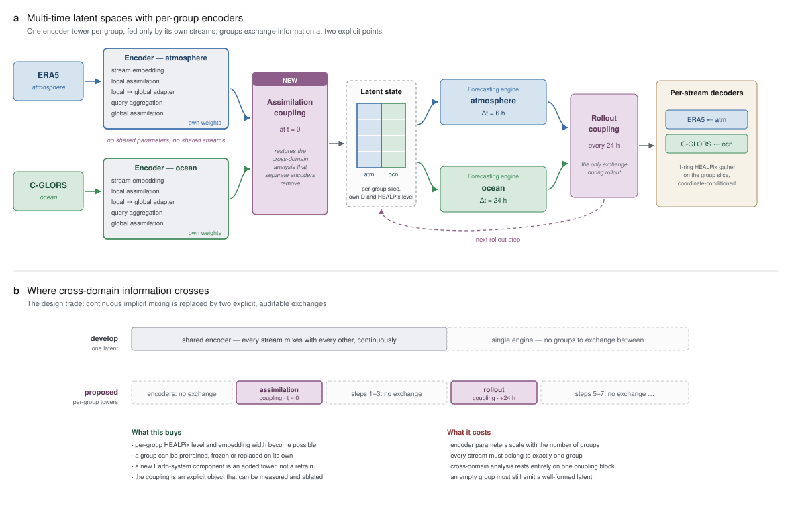

# Multi-time latent spaces — reference

WeatherGenerator on `develop` has exactly one latent space: one encoder writes every stream onto
one shared set of learnable queries, and a single `ForecastingEngine` advances the whole tensor
with one fixed time step. For coupled configurations — ERA5 + C-GLORS, atmosphere + ocean + land
— this forces fast and slow dynamics through identical machinery at identical cadence.

**Latent groups** give each Earth-system component its own encoder tower, its own latent tensor
and its own dynamical time step. Towers share no parameters and no inputs; they exchange
information at exactly two points, an assimilation coupler at t = 0 and a periodic rollout
coupler.

This document is the reference: how it works, the schema, and how to run it. The case for the
design, the alternatives considered and the evaluation plan are in
[`multi_time_latents_proposal.md`](multi_time_latents_proposal.md).

> **Status, 2026-09-23.** Phases 0-2 of the proposal are implemented on branch `multiple_latent`,
> rebased onto `develop` (`f730876c`): the schema and its validation, per-group encoder towers,
> per-group forecasting engines with stride dispatch, and both couplers.
> `tests/test_latent_groups.py` passes 22/22 and `tests/test_latent_groups_model.py` 18/18; the
> latter builds the grouped module tree on CPU and pins the stride dispatch, but no test runs a
> full forward pass, because every attention class calls into flash-attn unconditionally. Per-group
> `dim_embed` is still inert and the model rejects differing widths — that is phase 3. The
> September implementation, which used a *shared* encoder with groups as slices of the query axis,
> was lost to a `git restore` on 2026-09-17 and has been superseded rather than restored. The
> independent `ae_local_num_queries > 1` fix lives on branch `multi_query_fix`.

## Architecture

The model as it stands on `develop`, for reference — one encoder, one latent, one cadence shared
by every stream:



With multi-time latent spaces, each component gets its own tower and its own time step, and the
two couplers become the only places they meet:



Per group *g*, everything from stream embedding through global assimilation is that group's own:
its own `q_cells`, its own adapter, its own width `D_g`. The assimilation coupler then mixes the
towers once, before the rollout begins. During rollout each group is advanced by its own engine
only on the steps where its stride fires, held constant in between, and the rollout coupler mixes
the groups at its own cadence.

Decoders are unchanged in kind: per stream, coordinate-conditioned, gathering the 1-ring HEALPix
neighbourhood — but from the tower the stream decodes from.

## Streams and groups: two separate relations

This is the part most easily got wrong. A stream has **two** independent relationships to groups.

| Relation | Where it is declared | Cardinality |
|---|---|---|
| **Input membership** — which towers ingest it | `latent.groups.<g>.streams` | a stream may feed **several** towers |
| **Decode target** — which latent it is predicted from | `streams.<s>.latent_group` | exactly **one** |

Multi-membership exists because observations do not respect domain boundaries: satellite
radiances see the whole column, and SYNOP 2 m temperature over sea is set by both the atmosphere
and the skin temperature beneath it. Such a stream is listed under both towers, paying its
embedding twice, and still decodes from one.

The converse is also allowed: a diagnostic, target-only stream may be decoded from a tower
without being one of its inputs.

## Token layout

Each tower produces its own tensor:

```
group g : [B, N_cells(g) * Q, D_g]
```

There is no shared query axis. This is the main simplification over the superseded design, where
groups were contiguous slices of `ae_local_num_queries` and the cell-major / query-minor layout
had to be maintained by hand across the encoder and the decoder gather. `Q` reverts to 1, the
`queries` config key is gone, and with it a whole class of layout bugs.

`N_cells(g)` is per group only once per-group HEALPix levels land (phase 4); until then all
towers share `healpix_level`.

## Configuration

The `latent` block sits at the top level, beside the `ae_*` and `fe_*` keys. Its default in
`config/default_config.yml` is `groups: null`, which is exactly the single-latent behaviour.

```yaml
latent:
  # decode target for streams that do not set 'latent_group', and the tower a single-latent
  # checkpoint is mapped onto when warm-starting
  default_group: atmosphere

  groups:
    atmosphere:
      streams: [ERA5]             # input membership; may overlap with other groups
      dim_embed: 2048             # defaults to ae_global_dim_embed
      encoder:                    # per-tower overrides of the ae_* defaults
        ae_global_num_blocks: 4
      forecast:                   # omit entirely for a latent that is never advanced
        time_step: 06:00:00       # whole multiple of <stage>.forecast.time_step
        num_blocks: 16            # each fe_* key defaults to the top-level fe_* value
        num_heads: 16
        dropout_rate: 0.1
    ocean:
      streams: [C-GLORS]
      dim_embed: 1024
      encoder:
        ae_global_num_blocks: 2
      forecast:
        time_step: 24:00:00
        num_blocks: 8

  coupling:                       # null to leave the towers independent throughout
    dim_embed: 2048               # shared width; required when groups differ in width
    assimilation:                 # runs once, after the encoders
      num_blocks: 2
      num_heads: 32
    rollout:                      # runs periodically, between rollout steps
      time_step: 24:00:00
      num_blocks: 1
      num_heads: 32
```

The two couplers are separate modules with separate weights: the assimilation coupler reconciles
observations of different domains taken at the same time, the rollout coupler exchanges forecast
state between components running at different rates. They do different jobs.

`config/config_forecasting_coupled.yml` is the worked example, on
`config/streams/era5_cglors/`.

### The ocean data

C-GLORS v8 at `/e/scratch/weatherai/cosi1/nemo_cglorsv8_subset_1993_2023.zarr`: global, daily, on
the ORCA0.25 native grid (1050 × 1440 = 1,512,000 points per timestep), 1993-01-01 to 2023-12-31,
with per-variable mean and standard deviation in the store. Reached by adding
`/e/scratch/weatherai/cosi1` to `data_paths` in the private repository's
`jupiter/config/paths.yml`; the stream config keeps the bare filename. This replaces the Arctic
v7 subset the configuration originally named, which was never staged here.

Three properties of the store bear on the configuration. Only 1,218,909 points per timestep carry
data — the rest are a land mask encoded as the coordinate sentinel `(-1, -1)`, with a NaN pattern
identical across all four channels, which is why the stream sets `drop_all_nan_rows`. The 1540
points in the densest HEALPix level-5 cell are what set `token_size: 32`, since 8 would put 193
tokens in that cell against a ceiling of 64. And 35 % of the valid points lie poleward of 60°
against 13 % of the global area, which is why the stream carries
`location_weight: cosine_latitude`.

Because the record is daily and the base step is 6 h, the ocean tower only has an analysis in the
windows that start at 00 UTC — see the note under Cadence below.

### Cadence

A group's cadence is a **duration**, not a step count. The integer stride is derived at model
construction as `group.forecast.time_step / <stage>.forecast.time_step`, so changing the base step
keeps each group's physical time step intact instead of silently re-scaling it.

Group *g* is advanced at output step *i* when `i % stride_g == 0`, where *i* runs over
`batch.get_output_idxs()`, i.e. `range(offset, offset + num_steps)`. Note this does **not** start
at zero when `offset: 1`.

Time steps are read tolerantly: `24:00:00` parses as the integer `86400` under YAML 1.1, as a
string in a resumed run config, and as a `timedelta64` once resolved. All three yield 24 hours.

In the coupled configuration the base step is 6 h with `offset: 1` and `num_steps: 4`, so
`_get_output_length` gives 5 and the output indices are `range(1, 5)`. The atmosphere has stride 1
and fires at all four; the ocean has stride 4 and fires only at step 4, where one application of
its engine covers the 24 h separating the analysis from that step's target.

**`forecast.time_step` must be a whole multiple of `<stage>.time_window_step`.** This is not
checked anywhere and it is easy to get wrong when a slow stream tempts you into widening the
window step. The target window is located in *window-index space* by integer division,
`step_forecast_dt = idx + (time_step * i) // time_window_step`
(`multi_stream_data_sampler.py`), so a 6 h forecast step under a 24 h window step maps the
+6 h, +12 h and +18 h targets all onto the analysis window itself: every stream would be
trained to reproduce *t* = 0, and `_calc_baseperms` would reserve no windows for the horizon
either. Aligning a daily stream to 00 UTC is therefore not something `time_window_step` can buy.

A stream whose own cadence is coarser than the base step simply has no data in the windows that
fall between its records — `get_dataset_indexes_timestep` returns an empty index range unless the
window starts exactly on one. Its tower then falls through the masked-cell path, its target is
spoofed, and `is_spoof` zeroes its loss for that sample. Correct, but diluted: C-GLORS, being
daily, contributes an analysis in one window out of four. Making a daily mean valid for the whole
day is a reader-side change and a semantic choice, not a bug fix, and is not implemented.

### Decoding on steps where a group did not advance

> **Open decision.** Still unresolved, and sharper than before: with separate towers there is no
> shared trunk through which information can leak between groups.

`advance_latent` skips a group whose stride does not fire, but `predict_decoders` runs at every
output step for every stream. In the coupled configuration the C-GLORS decoder is called four
times while the ocean latent advances once: at steps 1 to 3 it reads the encoder state while its
target is already 6, 12 or 18 h ahead. This is the row of open markers in panel b of the figure.

The predictions at those steps are not identical, because the decoder is conditioned on target
coordinates carrying the time relative to the window — so it is the *decoder*, not the forecasting
engine, that absorbs the offset.

**(a) Accept it.** Costs nothing, and the loss at the non-advancing steps still trains the
encoder's ocean tower, since the latent the decoder reads at those steps *is* the encoder output.
The drawback is that the task shifts with the rollout length: the decoder sees the target time,
not the staleness of the latent, so a longer rollout presents the same physical offset in a
combination the model has never seen. This composes badly with a `num_steps` curriculum.

**(b) Mask the loss.** Zero the loss weight for a stream on the steps where its group did not
advance — the model-side analogue of the spoof mechanism, which already zeroes the weight for
targets a stream cannot supply. The machinery is in place: `output_step_loss_weights` is already
built inside the per-stream loop in `loss_module_physical.py`, a zero weight is excluded from the
normalisation because the `ctr_loss_fcts` counter only increments on a positive weight, and
`LossPhysical` already holds the full config, so no plumbing is needed to reach
`get_stream_latent_group`. The cost is training signal: C-GLORS would learn from one target per
rollout instead of four, and three of four ocean decoder passes become wasted compute. Skipping
those passes outright would save the compute but requires `ModelOutput` and the validation writer
to tolerate missing entries.

A third option makes (a) well posed: feed the decoder the staleness explicitly, as an extra
channel alongside the relative time. It changes the input width of `embed_target_coords`, so the
warm-start remap has to pad that module.

### Validation

`validate_latent_groups` in `packages/common/src/weathergen/common/config.py` runs once per stage
from the trainer and rejects:

| Condition | Reason |
|---|---|
| A group with no input streams | The tower would emit only learnable queries |
| An input stream that is not a defined stream | Typo, or a stale streams directory |
| A stream naming an undefined decode group, or no group and no `default_group` | Decoding has no latent to read |
| Streams linked by `pred_spatial_shared` decoding from different groups | The shared target engine is dimensioned for one tower |
| A group time step that is not a whole multiple of the base step | The stride would not be an integer |
| A rollout too short to fire a group | Its engine would get no gradient, which FSDP2 does not tolerate |
| Groups of differing width with no `coupling.dim_embed` | The coupler has no space to mix them in |
| `latent_group` on a stream while `latent.groups` is null | Silent no-op otherwise |

The short-rollout check uses the **minimum** of `forecast.num_steps`, which may be a
per-mini-epoch curriculum under the `sequential` policy — an early short mini-epoch would
otherwise starve a slow group mid-run.

## Implementation map

| File | Change |
|---|---|
| `config/default_config.yml` | The `latent` block, defaulting to `groups: null` |
| `packages/common/.../common/config.py` | `validate_latent_groups` plus `get_latent_groups`, `get_latent_group_streams`, `get_latent_group_dims`, `get_latent_group_strides`, `get_latent_coupling_stride`, `get_stream_latent_group` |
| `src/weathergen/model/encoder.py` | `EncoderModule` instantiated per group, restricted to that group's streams |
| `src/weathergen/model/engines.py` | `CouplingEngine` with per-group projections into `coupling.dim_embed`; its block list is named `fe_blocks` so sharding and parameter reporting treat it like a forecasting engine |
| `src/weathergen/model/model.py` | `encoders` and `forecast_engines` module dicts; `advance_latent` dispatches per group; `predict_decoders` reads the decode target's tower |
| `src/weathergen/model/model_interface.py` | FSDP shards every tower and both couplers; warm-start remap from a single-latent checkpoint |
| `src/weathergen/train/trainer.py` | Calls the validator in the existing per-stage loop |

## Warm-starting from a single-latent checkpoint

A pretrained single-latent model can seed a grouped one: the checkpoint's `encoder.*` and
`forecast_engine.*` keys are remapped onto `encoders.<default_group>.*` and
`forecast_engines.<default_group>.*`. Every other tower has no counterpart and is initialised
fresh by the existing missing-key path in `load_model`, which calls `to_empty` + `reset_parameters`
and logs each new module. Both couplers are initialised near the identity so they do not disrupt
the warm-started dynamics.

## Staged training

Towers and engines land at `encoders.<name>` and `forecast_engines.<name>` in the module tree, and
`freeze_modules` matches module paths by regex, so staged training needs no new machinery:

```yaml
freeze_modules: "encoders\\.atmosphere.*|forecast_engines\\.atmosphere.*"
```

## Running on HPC

The entrypoint is `launch-slurm.py` in the `WeatherGenerator-private` repository, run from the
`WeatherGenerator` checkout. On JSC Jupiter the bundled Slurm script requests the `weatherai`
account and the `booster` partition with 4 GPUs per node.

Set the environment up once:

```bash
cd WeatherGenerator
./scripts/actions.sh sync            # uv sync --all-packages --extra gpu
```

### Training the coupled configuration

```bash
../WeatherGenerator-private/hpc/launch-slurm.py \
  --stage train \
  --slurm-script ~/WeatherGenerator-private/hpc/jupiter/weathergen_slurm.sh \
  --base-config $PWD/config/config_forecasting_coupled.yml \
  --nodes 1
```

> **Pass `--base-config` as an absolute path.** A *relative* path is resolved against the configs
> repository (`--config-dir`, a sibling checkout such as `WeatherGenerator-configs`), not against
> the `WeatherGenerator` repository — so `config/config_forecasting_coupled.yml` would not resolve
> to the file in this repo.

### Overriding the latent schema without editing files

`--options` takes dotted `key=value` overrides that win over everything else:

```bash
../WeatherGenerator-private/hpc/launch-slurm.py \
  --stage train \
  --slurm-script ~/WeatherGenerator-private/hpc/jupiter/weathergen_slurm.sh \
  --base-config $PWD/config/config_forecasting_coupled.yml \
  --options latent.groups.ocean.forecast.time_step=48:00:00 \
            training_config.forecast.num_steps=8 \
  --nodes 2
```

Raising a group's time step raises its stride, so `num_steps` has to stay large enough for it to
fire, or startup validation will reject the run and tell you the minimum.

### Warm-starting from an existing run

```bash
../WeatherGenerator-private/hpc/launch-slurm.py \
  --stage train \
  --slurm-script ~/WeatherGenerator-private/hpc/jupiter/weathergen_slurm.sh \
  --base-config $PWD/config/config_forecasting_coupled.yml \
  --options load_chkpt.run_id=<single_latent_run_id> \
  --nodes 1
```

Use `load_chkpt.run_id` — which loads weights into a fresh run — rather than `--from-run-id`,
which continues a run under its own recorded config and would not pick up the new architecture.
Check the log for which tower the checkpoint was mapped onto and which were initialised fresh.

### Tests

```bash
uv run pytest tests/test_latent_groups.py       # schema validation, 21 cases, CPU only
uv run pytest integration_tests/small1_test.py  # regression guard for the single-latent path
```

CI's `unit-test` target runs `pytest src/` only, so nothing under `tests/` is exercised
automatically — these have to be run by hand until that target is widened.

The `ae_local_num_queries > 1` fix and its layout tests are on branch `multi_query_fix`, not here:
with per-tower latents this design no longer needs `Q > 1`, so the fix is an independent bug fix
against `develop`.

## Limitations and future work

- **Per-group HEALPix resolution is not yet implemented** (phase 4 of the proposal). All towers
  share `healpix_level` until the couplers can pool and broadcast along the nested hierarchy. This
  is the main prize of the separate-encoder design, so it should not be deferred indefinitely.
- **Cross-domain analysis rests entirely on the assimilation coupler.** If it trains poorly the
  model degrades into two independent models sharing a loss. The ablation in section 10 of the
  proposal is what detects this.
- **An empty group still emits a well-formed latent** — learnable queries plus positional encoding,
  with nothing assimilated. `is_spoof` handles the loss side, but the coupler will be attending to
  a latent carrying no information and is not currently told so.
- **Latent and SSL losses are not per group.** Per-group latent losses also need the multiple
  `LossLatentSSLStudentTeacher` TODO in `model.py` resolved first.
- **Decoding reads a single tower.** A `latent_read` key letting a stream decode from several
  groups is designed but not built.
